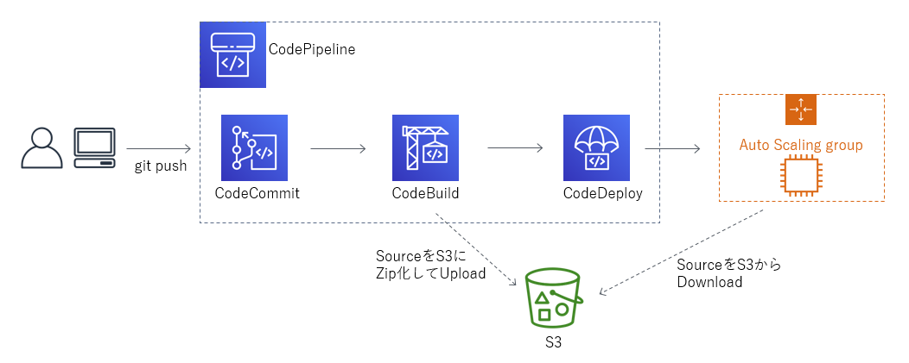

# AWS Code Series(EC2 AutoScaling Environment)
___

- 事前準備
  - AWS AccountID
  - アプリケーションのソースコードを保存するS3バケット
  - 作業用PCにAWS CLIをインストール
  - 作業用PCへGit(ver1.7.9以降)インストール
    - [Gitのダウンロードはこちら](https://git-scm.com/downloads)

- デモのフロー図



##  CodeCommit [(Document)](https://docs.aws.amazon.com/ja_jp/codecommit/latest/userguide/welcome.html)
___

#### CodeCommit利用(HTTPS接続)の事前準備

-  CodeCommitアクセス用のIAM User作成
  - IAM Policyは[AWSCodeCommitFullAccess]を付与
- CodecomitへのHTTPS接続用のGit認証情報を作成
  - [IAM User] -> [認証情報] -> [AWS CodeCommit の HTTPS Git 認証情報] -> [生成]


#### CodeCommitの利用(AWS CLI)

1. CodeCommitリポジトリ作成

```
$ aws codecommit create-repository --repository-name MyDemoRepo --repository-description "My demonstration repository"
{
    "repositoryMetadata": {
        "accountId": "xxxxxxxxxxx",
        "repositoryId": "xxxxxx-xxxxxx-xxxxxx-xxxxxx-xxxxxx",
        "repositoryName": "MyDemoRepo",
        "repositoryDescription": "My demonstration repository",
        "lastModifiedDate": 1558505627.386,
        "creationDate": 1558505627.386,
        "cloneUrlHttp": "https://git-codecommit.us-east-1.amazonaws.com/v1/repos/MyDemoRepo",
        "cloneUrlSsh": "ssh://git-codecommit.us-east-1.amazonaws.com/v1/repos/MyDemoRepo",
        "Arn": "arn:aws:codecommit:us-east-1:xxxxxxxxxxx:MyDemoRepo"
    }
}
```

2. CodeCommitリポジトリに接続

```
# 事前に準備したIAMのGit情報を用いて、CodeCommitにリポジトリのクローンを作成
$ git clone https://git-codecommit.us-east-2.amazonaws.com/v1/repos/MyDemoRepo my-demo-repo
Cloning into 'my-demo-repo'...
warning: You appear to have cloned an empty repository.

# ローカルリポジトリをCodeCommitリポジトリに接続
$ git init
$ git remote add origin https://git-codecommit.us-east-2.amazonaws.com/v1/repos/MyDemoRepo
$ git remote -v
origin  https://git-codecommit.us-east-1.amazonaws.com/v1/repos/MyDemoRepo (fetch)
origin  https://git-codecommit.us-east-1.amazonaws.com/v1/repos/MyDemoRepo (push)
```


## CodeBuild [(Document)](https://docs.aws.amazon.com/ja_jp/codebuild/latest/userguide/welcome.html)
___

- 今回の利用用途はS3にある

-  CodeBuild用IAM Role作成

```
# CodeBuild用IAM Role作成
$ aws iam create-role --role-name DemoCodebuildRole --assume-role-policy-document file://IAM/codebuild-role.json

# CodeBuild用IAM RoleにPolicyを付与
$ aws iam put-role-policy --role-name DemoCodebuildRole --policy-name DemoCodeBuildServiceRolePolicy --policy-document file://IAM/codebuild-policy.json
```

- Codebuild作成

```
# CodeBuild作成
$ aws codebuild create-project --cli-input-json file://CodeBuild/create-project.json

# 参考) CodeBuildで利用できるContainer確認
$ aws codebuild list-curated-environment-images
```


## CodeDeploy [(Document)](https://docs.aws.amazon.com/ja_jp/codedeploy/latest/userguide/welcome.html)
___

- CodeDeploy用IAM Role作成

```
# ./IAM/codedeploy.jsonを基にCodeDeployのRole作成
$ aws iam create-role --role-name CodeDeployServiceRole --assume-role-policy-document file://IAM/codedeploy-role.json

# EC2用のPolicyを付与
$ aws iam attach-role-policy --role-name CodeDeployServiceRole --policy-arn arn:aws:iam::aws:policy/service-role/AWSCodeDeployRole

# ECS用のPolicyを付与
$ aws iam attach-role-policy --role-name CodeDeployServiceRole --policy-arn arn:aws:iam::aws:policy/AWSCodeDeployRoleForECS
```

- EC2用IAM Role作成

```
# EC2用IAM Role作成
$ aws iam create-role --role-name DemoEC2CodeDeployRole --assume-role-policy-document file://IAM/ec2-codedeploy-role.json

# EC2用IAM RoleにS3参照用のPolicyを付与
$ aws iam put-role-policy --role-name DemoEC2CodeDeployRole --policy-name DemoEC2Permissions --policy-document file://IAM/ec2-codedeploy-policy.json
$ aws iam create-instance-profile --instance-profile-name DemoCodeDeployEC2Profile
$ aws iam add-role-to-instance-profile --instance-profile-name DemoCodeDeployEC2Profile --role-name DemoEC2CodeDeployRole
```

- EC2 AutoScaling グループの作成

```
# LanuchConfig作成...UserdataにてCodeDeployのエージェントを設定
$ aws autoscaling create-launch-configuration --launch-configuration-name demo-codedeploy-lc --image-id image-id --key-name key-name --iam-instance-profile DemoCodeDeployEC2Profile --instance-type t1.micro --user-data file://EC2/instance-setup.sh

# AutoScalingGroup作成
$ aws autoscaling create-auto-scaling-group --auto-scaling-group-name demo-codedeploy-asg --launch-configuration-name demo-codedeploy-lc --min-size 1 --max-size 1 --desired-capacity 1 --availability-zones us-east-1a us-east-1b
```

- Codedeploy作成

```
# アプリケーション作成
$ aws deploy create-application --application-name DemoAsgApp

# デプロイグループの作成
$ aws deploy create-deployment-group --application-name DemoAsgApp --auto-scaling-groups demo-codedeploy-asg --deployment-group-name DemoAsgDG --deployment-config-name CodeDeployDefault.OneAtATime --service-role-arn service-role-arn

# デプロイの実行
$ aws deploy create-deployment --application-name DemoAsgApp --deployment-config-name CodeDeployDefault.OneAtATime --deployment-group-name DemoAsgDG --s3-location bucket=aws-codedeploy-us-east-1,bundleType=zip,key=samples/latest/SampleApp_Linux.zip
```

## CodePipeline [(Document)](https://docs.aws.amazon.com/ja_jp/codepipeline/latest/userguide/welcome.html)
___

#### CodePipelineの利用(Console)

- CodePipelineの作成
  - ソースはCodeCommitを選択し、上記で作成したリポジトリを選択
  - 検出オプションは"CloudWatch Events"を選択
    - CodeCommitに対して変更があった場合に実行される

-
